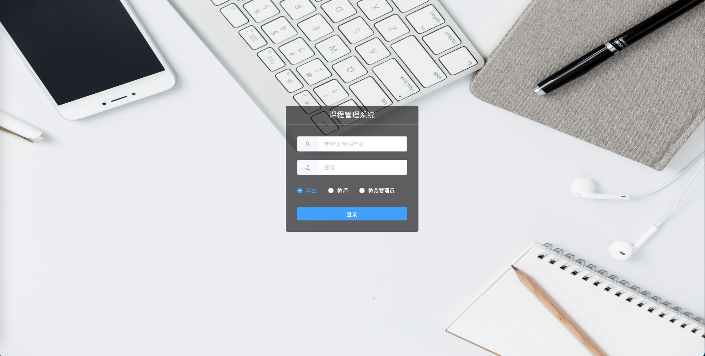
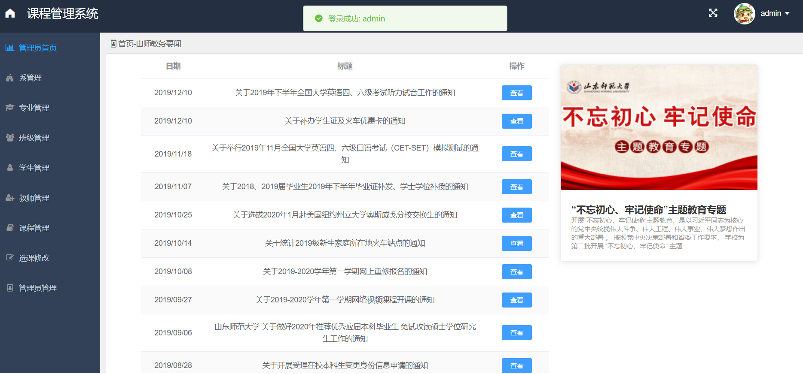
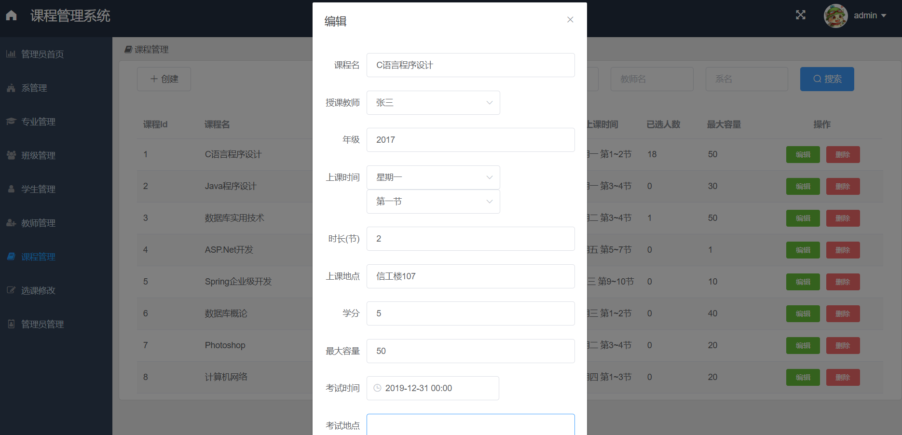
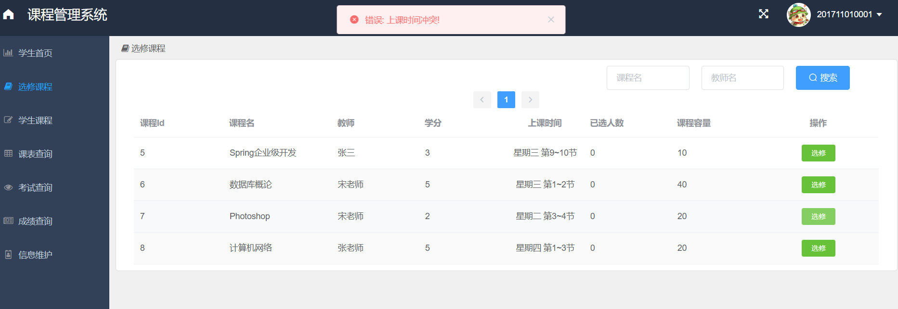
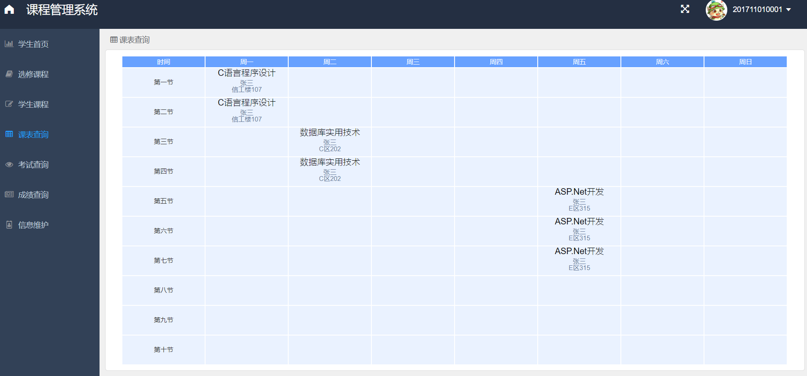
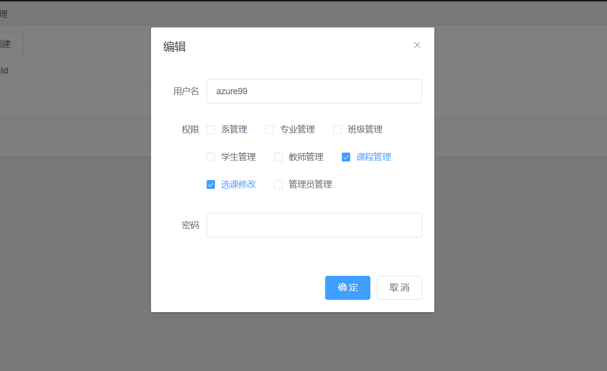

# 课程管理系统
学生选课系统，前后端分离界面美观💎使用流行技术栈Vue ElementUI SpringBoot，Redis实现分布式Session，AOP记录日志由MongoDB存储，可做学习使用

### 在线预览地址
http://39.101.133.125:1007

| 账号    | 密码     |
| -------- | -------- |
| test | admin123 |

学生/教师/管理员账号密码相同

##### 此账号为演示账号, 权限较低, 如果需要较高权限账号请联系作者
### 作者QQ：1556708905, (支持修改、 部署调试、 支持代做毕设)

## 技术栈

### 前端Vue.js

- ElementUI
- axios

### 后端SpringBoot

- 持久层: Mybatis Plus
- 授权认证: 手写
- 会话: Spring Session + Redis
- 日志: AOP + MongoDB

### 数据库

- MySQL(MariaDB): 核心业务
- Redis: Session、新闻、配置信息
- MongoDB: 业务日志

## 项目截图

